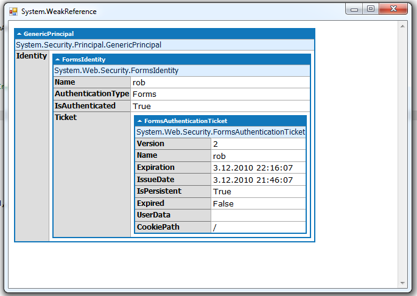

#A Microsoft Visual Studio debugger visualizer that uses LINQPAD Dump function
So, what is this? I love LINQPad (http://www.linqpad.net/) and especially like it's Dump extension method, which formats any object very nicely. Wouldn't it be great to have something like this in Visual Studio?

Well, here is my first simple try.

I'm using a hack from Mole Project to get around the limitation of VS debugger visualizers that only allow you to have a visualizer be tied to a certain type.

##Changes
###Version 1.0.4
Support for Visual Studio 2012 added. (download only has 2012 version) Latest version of Linqpad - for .net framework 4.

###Version 1.0.3
 1. Depth limit of shown object increased to 50 for VS2010 version.

###Version 1.0.2
 1. Added support for JSON serialization so you can now use the visualizer with any C# POCO object, even if it isn't serializable

###Version 1.0.1
 1. VS2010 support

###1.0
 1. Initial version

##How to use it
 1. Get the source
 2. Get LINQPad - I've tested it with 4.30 and 2.30.
 3. either get the compiled .dll from Downloads or compile the project from source.

If compiling do the following:

 1. put linqpad.exe in the References folder
 2. compile the project - it is currently tested in VS 2008 SP1 and VS2010 (use correct solution)
 3. copy everything from bin\debug directory to Documents\Visual Studio 2008\Visualizers (or Visual Studio 2010)
 4. copy linqpad.exe to where devenv.exe resides. On my system this is C:\Program Files (x86)\Microsoft Visual Studio 9.0\Common7\IDE for 2008 and C:\Program Files (x86)\Microsoft Visual Studio 10.0\Common7\IDE for 2010.

If using the download do this:

 1. copy the .dll and linqpad.exe to Documents\Visual Studio 2008\Visualizers (or Visual Studio 2010)
 2. copy linqpad.exe to where devenv.exe resides. On my system this is C:\Program Files (x86)\Microsoft Visual Studio 9.0\Common7\IDE for 2008 and C:\Program Files (x86)\Microsoft Visual Studio 10.0\Common7\IDE for 2010.

Then do:

 1. restart visual studio
 2. open a project that you want to debug and start debugging
 3. when you want to run the visualizer go to the watch pane and enter the variable you want to inspect like this: **new System.WeakReference(variable_to_inspect)** (this is because of limitation of Visual Studio so we can attach the visualizer to any type)
 4. then click on the downarrow on the right side of the row and a form with the dump should popup
 5. if using VS2010 you have two options - LINQPad visualizer and LINQPad visualizer JS. The first one uses normal serialization and can therefore only be used on objects which have Serializable on them. Second one uses JSON.NET to serialize objects, but in the process you lose type information. However, you can use it on any object.

It should look like this:

If you want to take this further, let me (robert.ivanc@gmail.com) know and I'll add you to the contributers list.
